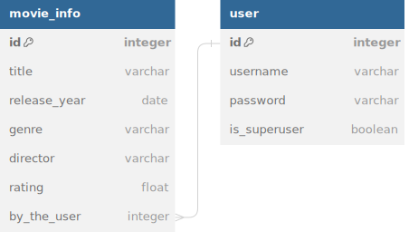

# Proyecto FastAPI CRUD

Este es un proyecto de aprendizaje diseñado para demostrar el uso de [FastAPI](https://fastapi.tiangolo.com/) en la creación de una API RESTful que realiza operaciones CRUD (Crear, Leer, Actualizar, Eliminar) y se conecta a una base de datos externa. Este proyecto te proporciona un punto de partida para desarrollar tus propias API con FastAPI y conectarlas a diversas bases de datos.

## Características clave

- **FastAPI**: Utilizamos FastAPI, un marco web moderno y de alto rendimiento para crear una API RESTful. FastAPI facilita la definición de rutas, validación de datos, autenticación y más.

- **CRUD Operations**: Implementamos las cuatro operaciones fundamentales en una base de datos: Crear (Create), Leer (Read), Actualizar (Update) y Eliminar (Delete).

- **Base de Datos Externa**: Conectamos la API a una base de datos externa y mantenida por AWS para almacenar y recuperar datos. 

- **Documentación Automática**: FastAPI genera automáticamente una documentación interactiva (Swagger UI) para la API, lo que facilita su comprensión y uso.

## Estructura de la base de dato

## Instrucciones de Uso

1. Clona este repositorio a tu máquina local:

   ```
   git clone https://github.com/tuusuario/fastapi-crud-project.git
   cd fastapi-crud-project
   ```

2. Crea un entorno virtual (se recomienda utilizar [virtualenv](https://virtualenv.pypa.io/en/latest/)) e instala las dependencias:

   ```
   python -m venv venv
   source venv/bin/activate  # En Windows, utiliza "venv\Scripts\activate"
   pip install -r requirements.txt
   ```

3. Configura la base de datos en el archivo `config.py` y asegúrate de que la API esté conectada a la base de datos que deseas utilizar.

4. Ejecuta la aplicación:

   ```
   uvicorn main:app --reload
   ```

5. Accede a la documentación de la API en tu navegador en [http://localhost:8000/docs](http://localhost:8000/docs) y comienza a probar las operaciones CRUD.

## Licencia

Este proyecto se distribuye bajo la licencia [MIT](LICENSE). Siéntete libre de utilizarlo y modificarlo según tus necesidades.
